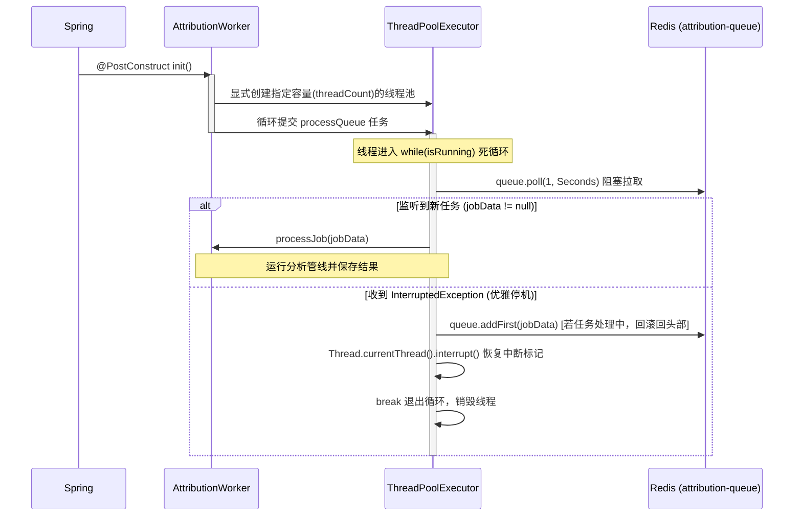

# AttributionWorker — 任务管道调度与执行器说明文档

[AttributionWorker](file:///Users/yfsun/mywork/code-attribution-engine/src/main/java/com/macaber/attribution/core/queue/AttributionWorker.java) 是归因分析引擎的核心调度器。它常驻后台，充当 Redis 队列消费者，整合文件分块、AI 消息拉取、相似度计算以及结果持久化。

---

## 1. 核心属性与配置 (Properties & Configuration)

`AttributionWorker` 依赖以下核心服务和配置参数：

* **核心依赖注入**：
  * `RedissonClient`：连接 Redis 并获取双端阻塞队列。
  * `SimilarityEngine`：核心相似度比对管线。
  * `AiMessageService`：查询数据库获取用户的 AI 历史生成代码。
  * `AttributionResultService` / `AttributionChunkDetailService`：结果持久化服务。
  * `AttributionFailedJobService`：持久化报错任务的归档数据库表。
* **参数配置** (`application.properties`)：
  * `attribution.worker.threads` (默认 `2`)：后台工作线程数，用以执行并行消费。
  * `attribution.worker.ai-message.limit` (默认 `1000`)：比对时单用户拉取历史 AI 消息的最大上限。
  * `attribution.worker.ai-message.timeframe-days` (默认 `30`)：拉取历史 AI 消息的时间窗口跨度（天数）。

---

## 2. 线程模型与队列消费流 (Thread Model & Queue Consumption)

### 2.1 阻塞监听与优雅停机
在 `processQueue()` 中，工作线程通过一个 `while(isRunning)` 循环持续轮询：
1. **阻塞读取**：`jobData = queue.poll(1, TimeUnit.SECONDS)`。如果队列为空，线程会阻塞等待。
2. **发生中断 (优雅停机)**：
   - 当收到中断信号时，会抛出 `InterruptedException`。
   - **任务回滚**：如果此时 `jobData != null`（表明任务正在处理中且未完成），Worker 会执行 `queue.addFirst(jobData)`，将任务**即时回滚送回 Redis 队列头部**，让其他 Worker 或重启后的实例拉取，确保任务不丢失。
   - **退出循环**：调用 `Thread.currentThread().interrupt()` 恢复中断标记，并通过 `break` 退出循环销毁线程，完成安全停机。

---

## 3. 失败任务记录与堆栈精简 (Failed Job Log)

当 `processJob` 发生业务或连接级异常时，Worker 会调用 `handleFailedJob(jobData, ex)` 将错误归档到数据库表 `attribution_failed_jobs`，并对消息和堆栈进行精简。

### 3.1 异常消息精简 (`simplifyErrorMessage`)
- 提取发生异常的类名和主要消息。
- 循环向下寻找根源异常（Root Cause）。
- 如果存在根源异常，格式化并追加，避免外层 RuntimeException 隐藏真实的底色。
- **示例**：`RuntimeException: Job processing failed [Root Cause: NullPointerException: Cannot invoke ...]`

### 3.2 堆栈精简 (`simplifyErrorStack`)
传统的 Java 异常堆栈信息包含了大量的 Spring 代理反射、Redisson 连接轮询、Tomcat/Servlet 容器内部运行帧，噪音极大。精简规则如下：
1. **保留前 8 个原始帧**：确保异常发生的第一案发现场（如 NullPointerException 抛出处）被完整保留，即使它属于 JDK 或第三方依赖库。
2. **保留所有 `com.macaber.` 帧**：对整个堆栈遍历，凡是属于我们自己包路径下的业务代码调用链路，无视深度，全部予以保留。
3. **折叠冗余帧**：其余的 Spring 框架帧、Tomcat 内部运行帧会被截断折叠，并在日志末尾打印如 `... 45 more framework/internal frames truncated`。
4. **防循环引用**：在递归解析 Nested Cause（引发原因）时，使用 `Set<Throwable>` 记录已访问的异常对象，杜绝循环引用引发内存溢出或死循环。

---

## 4. 任务执行主生命周期 (`processJob`)

`processJob` 函数接收到 `AttributionJobData` 后，按以下步骤运行相似度归因比对：

### 4.1 详细步骤分解

#### 步骤 1：Diff 拆分与 Chunk 增强
- 遍历 `jobData.getFileDetails()`。
- 使用 `DiffParser` 解析 diff，将文件改动行拆分为 `DiffChunk`。
- 将 `DiffChunk` 包装为 `EnrichedChunk`，绑定对应的合并后完整源码（`code` 字段），用于后续 L3 语法层解析。

#### 步骤 2：收集相关用户并拉取 AI 历史记录
- 收集所有 Chunk 所归属的 `userId` (OA 账号)。如果 Diff 中不带有用户标记，则降级使用合并请求的发起人 `jobData.getUserId()`。
- 调用 `fetchAiMessages` 查询数据库，拉取最近一个月内该批用户调用大模型生成代码（`edit` 或 `write` 函数工具调用参数里的代码）的历史记录，每次最多拉取 1000 条。
- 对拉取到的 AI 代码进行预规格化处理（使用 `Normalizer` 解析缓存其 Token 行列表与位置索引）。

#### 步骤 3：逐分块执行三层管线与去重 (`processChunk`)
- 将每一个 `EnrichedChunk` 对抗该用户所有的 AI 消息，调用 `SimilarityEngine.evaluateChunk()`。
- **多消息贪心去重**：
  1. 筛选出所有有效匹配（L2 相似度 $\ge 10\%$ 或匹配行数 $\ge 3$）的贡献 AI 消息。
  2. 将候选消息按匹配行数及相似度得分进行双重降序排列。
  3. 执行贪心覆盖去重：从上至下遍历，如果有匹配行在之前的消息里没被覆盖过，则保留该消息，并将其提供的具体匹配行号并入全局 `mergedLineIndices` 集合中。
  4. 最终该 Chunk 的 `contributedLines = mergedLineIndices.size()`。
- **匹配分类归因**：
  从最终保留的贡献消息中，挑选得分最高的一条作为 `bestMatch`。根据其匹配层级给出定性：
  * **STRICT (指纹直接放行)**：`contributedLines` 直接采用 Chunk 去空行后的总行数。
  * **FUZZY (LCS 物理复制行)**：`contributedLines` 采用 Set 并集去重后的总匹配行数。
  * **DEEP_REFACTOR (AST 语义结构特征)**：`contributedLines` 取“LCS 匹配行数”与“总行数 * L3 结构得分”的最大值。

#### 步骤 4：持久化保存
- 汇总统计所有 Chunk 的 AI 贡献行数与占比，保存到 `attribution_reports` 成功报告表。
- 批量插入 Chunk 的溯源信息到 `attribution_chunk_details` 详情表。
