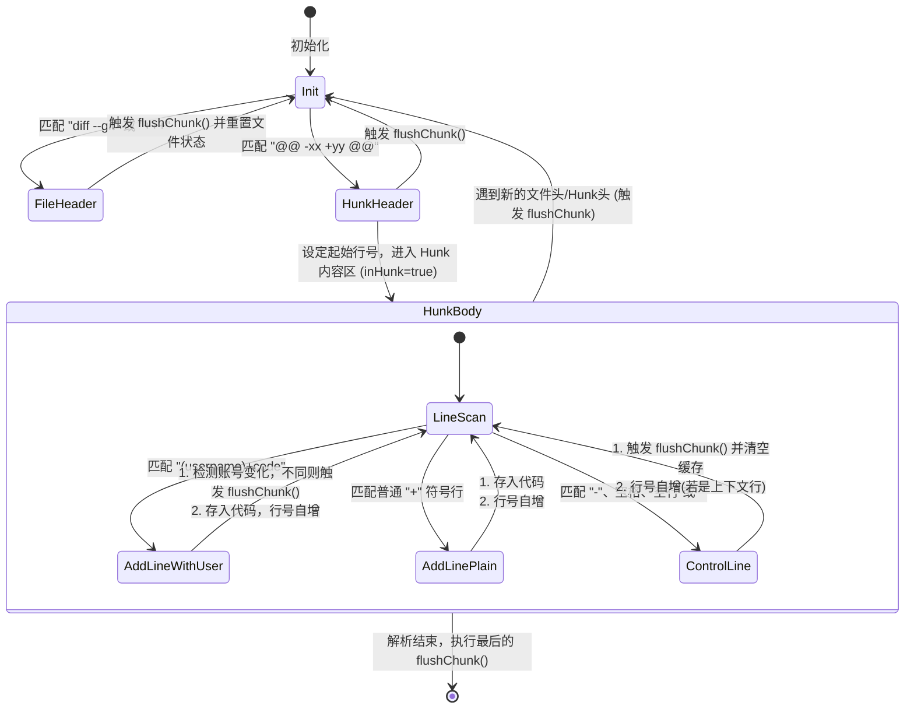

# DiffParser — Git Diff 解析与分块器说明文档

[DiffParser](file:///Users/yfsun/mywork/code-attribution-engine/src/main/java/com/macaber/attribution/core/DiffParser.java) 用于将接收到的 Git Unified Diff 纯文本进行结构化拆分，识别出连续的新增行，构建为逻辑上的归因块（`DiffChunk`）。

---

## 1. 核心职责 (Core Responsibilities)

* **Git Diff 行流式分析**：对 Unified Diff 纯文本逐行扫描。
* **剔除无意义行**：过滤掉删除行（以 `-` 开头）和上下文对照行（以空格开头或空行），**仅保留新增的代码行**。
* **连续块合并 (Grouping)**：在同一文件和同一个 hunk 内，将属于同一修改人（用户 OA）的**连续新增行**合并为一个 `DiffChunk`。
* **用户归属识别**：识别代码行上的用户 OA 账号（前缀），实现多人合并场景下的权限与比对隔离。

---

## 2. 状态机模型与解析流程 (State Machine)

`DiffParser` 内部维护了几个状态变量，用于在遍历行流时维持上下文：

| 状态变量 | 类型 | 说明 |
|---|---|---|
| `currentFilePath` | String | 当前正在解析的文件路径 |
| `currentLineNumber` | int | 当前新增行在合并后文件（右侧文件）中的行号 |
| `inHunk` | boolean | 是否处于有效的数据块（hunk）内部 |
| `currentChunkLines` | List\<String\> | 暂存当前正在合并的 Chunk 纯内容行 |
| `startLine` | Integer | 当前正在合并的 Chunk 的起始行号 |
| `currentUserId` | String | 当前正在合并的 Chunk 所归属的用户 OA |

### 2.1 状态转移图 (State Transitions)



---

## 3. 正则表达式模式 (Regex Patterns)

解析器依赖两个核心正则表达式进行提取：

1. **Hunk 头部匹配** (`CHUNK_HEADER_PATTERN`)
   ```java
   private static final Pattern CHUNK_HEADER_PATTERN = Pattern.compile("@@ -\\d+(?:,\\d+)? \\+(\\d+)(?:,\\d+)? @@.*");
   ```
   * **作用**：解析 `@@ -1,5 +1,8 @@` 这一行，抓取右侧文件（合并后目标文件）的起始修改行号（例如上面的 `1`）。
   
2. **带用户标识前缀的行匹配** (`USER_LINE_PATTERN`)
   ```java
   private static final Pattern USER_LINE_PATTERN = Pattern.compile("^\\(([^)]+)\\)\\s*([+-])(.*)$");
   ```
   * **作用**：解析如 `(sun_yunfeng)+public void test() {` 这样的行。
   * **捕获组说明**：
     * **Group 1** (`([^)]+)`)：提取出用户 OA 账号（如 `sun_yunfeng`）。
     * **Group 2** (`([+-])`)：操作类型，为 `+` 或 `-`。
     * **Group 3** (`(.*)`)：纯净的代码文本内容，自动剥离了前面的括号及算术操作符。

---

## 4. 用户前缀剥离与多人协同隔离 (User Prefix & Isolation)

在协同开发中，系统合并的 Diff 信息会在新增代码行前加上作者的 OA 账号。`DiffParser` 对此进行了针对性处理：

### 4.1 前缀剥离防止相似度干扰
如果 Diff 行被前缀污染（例如在代码前增加了 `(sun_yunfeng)+` 字符），直接参与比对会导致指纹（Winnowing）和最长公共子序列（LCS）计算出现大面积失真。
`DiffParser` 通过 `USER_LINE_PATTERN` 的 Group 3，**只将纯净的代码内容**存入 `currentChunkLines` 中，完全清除了前缀对归因管线的噪音干扰。

### 4.2 按用户隔离分块 (Chunk Splitting)
如果连续的新增行都是以 `+` 开头，但它们的修改人不同，例如：
```diff
(sun_yunfeng)+  int a = 1;
(zhuhongxin)+  int b = 2;
```
解析器在扫描到第二行时，会发现 `currentUserId` (`sun_yunfeng`) 与当前行的 `userId` (`zhuhongxin`) 不一致，从而**立刻触发 `flushChunk()`**。
这保证了同一个文件的同一个 hunk 内，不同作者的代码被分割到了独立的 Chunk 中，最终在比对时只会与各自的 AI 消息记录比对，防止互相“串线”。

---

## 5. Chunk 提交逻辑 (`flushChunk`)

当以下情况发生时，状态机会将当前缓存的 `currentChunkLines` 提交（Flush），生成一个 `DiffChunk` 实例：
* 扫描到新的文件头（`diff --git` 或 `+++`）。
* 扫描到新的 Hunk 边界行（`@@`）。
* 新增行的所有者 OA 账号发生切换。
* 扫描到删除行（`-`）或上下文非修改行（空格开头、空行等）。
* 全文扫描结束。

在 `flushChunk` 时，解析器会统计该 Chunk 的**有效非空行数**（`nonBlankLineCount`），作为后续 L2 LCS 计算匹配率的分母。
