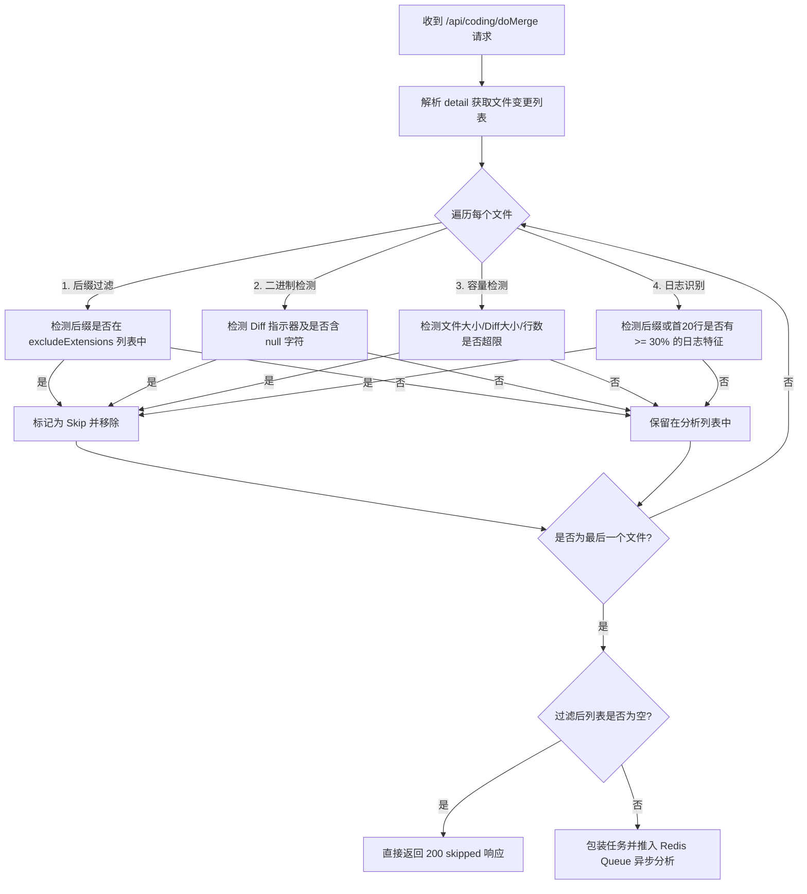

# Code Attribution Engine — 过滤规则说明文档 (AttributionFilter)

为了避免对非代码文件（如日志、图片、压缩包、二进制文件）以及过大文件进行无效的相似度归因分析，系统在 `WebhookController` 接收 Merge Webhook 时引入了 `AttributionFilter` 组件进行前置拦截与过滤。

该机制在任务入队前将不符合要求的变更文件剔除，能够有效减少 Redis 队列数据体积，降低后台工作线程（Worker）的资源开销，当整个 Merge 请求均无有效代码变更时直接返回 `skipped`，不占用任何计算资源。

---

## ⚙️ 过滤器配置参数 (Configuration)

过滤器所有的规则都可以通过 `src/main/resources/application.properties` 进行定制，核心配置项如下：

| 配置属性 (Properties) | 默认值 | 说明 |
|---|---|---|
| `attribution.filter.enabled` | `true` | 是否全局开启前置过滤器 |
| `attribution.filter.exclude-extensions` | `log,txt,png,jpg,jpeg,gif,pdf,zip,tar,gz,exe,dll,so,bin,woff,ttf,class,jar,lock,csv,tsv,xlsx` | 逗号分隔的排除文件后缀名（大小写不敏感） |
| `attribution.filter.max-file-size-kb` | `500` | 允许参与分析的单文件最大内容大小 (KB) |
| `attribution.filter.max-diff-size-kb` | `100` | 允许参与分析的单文件最大 Diff 字符串大小 (KB) |
| `attribution.filter.max-file-lines` | `5000` | 允许参与分析的单文件最大总行数 |
| `attribution.filter.filter-binary` | `true` | 是否自动过滤二进制文件 |
| `attribution.filter.filter-logs` | `true` | 是否自动识别并过滤日志文件或日志格式内容 |

---

## 🔍 核心过滤规则详解 (Rules)

过滤器执行以下 5 项流水线式的强校验逻辑，任何一项匹配成功即会将该文件跳过。

### 1. 后缀名排除校验 (File Extension Exclusion)
* **原理**：直接截取文件路径（`path`）中的最后一个小数点 `.` 之后的后缀名。
* **规则**：判断该后缀名是否包含在 `excludeExtensions` 配置的黑名单中。
* **特点**：后缀匹配不区分大小写。例如：`Main.class`、`package-lock.json`（`.lock`）或 `data.CSV` 等均会触发过滤。

### 2. 二进制文件智能检测 (Binary File Detection)
若 `filterBinary` 为 `true`，将进行以下双重深度检测：
* **Diff 头校验**：检测 Git Unified Diff 中是否含有以下经典二进制标识：
  * 包含 `Binary files ` 字段
  * 包含 ` differ\n` 结尾的二进制指示行
* **空字符（Null Byte）透传校验**：
  * 检测文件的合并后内容 `code` 中是否含有空字符 `\0`。
  * 检测文件的 `diff` 字符串中是否含有空字符 `\0`。
  * 存在任一 `\0` 即判定该文件为非文本的二进制编码，做过滤处理。

### 3. 容量及大小限制 (Size & Capacity Limits)
为了防范内存溢出（OOM）并保证系统的稳定运行，系统对单文件大小、Diff 大小和总行数设立了刚性上限：
* **源码文件体积限制**：`code` 内容长度（字节数）不能超过 `maxFileSizeKb` * 1024 字节（默认 500 KB）。
* **Diff 体积限制**：`diff` 字段长度不能超过 `maxDiffSizeKb` * 1024 字节（默认 100 KB）。
* **源码总行数限制**：通过统计 `\n` 换行符数量，计算 `code` 的总行数，若大于 `maxFileLines`（默认 5000 行）则过滤。

### 4. 日志文件与日志内容识别 (Smart Log Detection)
为了防止误把日志合并当作代码进行相似度比对，系统在 `filterLogs` 为 `true` 时采用智能特征加权算法识别日志内容：
* **后缀过滤**：若文件后缀名直接为 `.log`，直接过滤。
* **行特征扫描**：如果文件后缀不是 `.log`，但内容为非结构化日志时，系统会截取文件的前 **20** 行进行抽样检测。
  - 对于每一行非空内容，剥离 Git Diff 符号（`+` 或 `-`）后，通过正则特征提取：
    1. **时间戳特征**：检测是否含有形如 `2026-06-11 09:10:08` 或高精度毫秒时间 `09:10:08.123` 的日志特征时间戳。
    2. **日志级别特征**：检测是否包含 `INFO`、`WARN`、`ERROR`、`DEBUG`、`TRACE`、`FATAL`、`SEVERE`、`WARNING`（大小写不敏感）等日志级别关键字。
* **加权判定**：当有效抽样行数 $\ge 3$ 行时，若匹配到“时间戳”或“日志级别”特征的行占比 **$\ge 30\%$**，即判断该文件为日志片段，予以过滤。

---

## 🚀 过滤在 Webhook 层的执行流图

