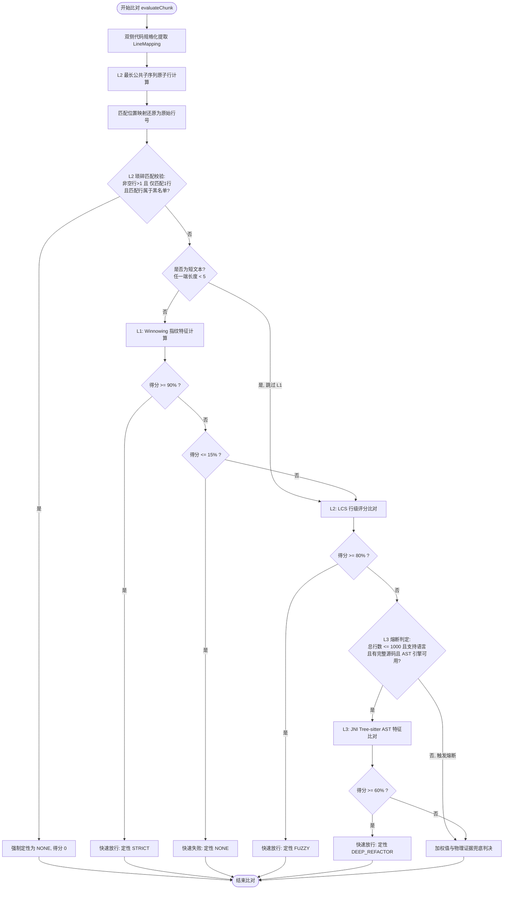

# SimilarityEngine — 并联仲裁相似度引擎说明文档

[SimilarityEngine](file:///Users/yfsun/mywork/code-attribution-engine/src/main/java/com/macaber/attribution/core/SimilarityEngine.java) 是整个代码相似度比对管线的核心。它采用 **并联仲裁管线 (Parallel Arbitration Pipeline)** 架构，通过 L1、L2、L3 三层维度对输入的 Diff Chunk 和历史 AI 消息进行联合判决。

---

## 1. 核心流程架构图 (Pipeline Flowchart)

---

## 2. 第一层：Winnowing 文档指纹 (L1 - 过滤与快速通行)

* **原理**：通过滑动窗口算法计算代码 Token 序列的 K-gram 哈希值，提取特征指纹集合。
* **度量指标**：包含度 (Containment) 相似度，分母为 Diff Chunk 侧指纹数：
  $$\text{L1 Score} = \frac{|F_{\text{Diff}} \cap F_{\text{AI}}|}{|F_{\text{Diff}}|}$$
* **阈值控制**：
  * **快速放行 (Fast-Pass)**：$\ge 90\%$ $\rightarrow$ 判定为 `STRICT` 匹配并提前结束。
  * **快速失败 (Fast-Fail)**：$\le 15\%$ $\rightarrow$ 判定为 `NONE` 并提前结束。
* **短文本旁路 (Short-text Bypass)**：如果任一端规格化文本长度小于窗口长度限制（默认 5 字符），则跳过 L1 直接进入 L2，防止单行极短代码（如 `return;`）因生成不了指纹而误判。

---

## 3. 第二层：最长公共子序列与琐碎过滤 (L2 - 行级物理追踪)

* **原理**：以**规格化后的非空行**为原子比对单元，计算两组序列的最长公共子序列（LCS）。
* **位置追踪**：根据 LCS 回溯出的匹配行索引，利用 `Normalizer` 的 `originalLineIndices` 书签映射，完美反查出原始 Diff 文件中的实际被匹配行号。
* **评分计算**：
  $$\text{L2 Score} = \frac{\text{LCS 匹配行数}}{\text{Diff 侧规格化非空总行数}}$$
* **快速放行**：当 $\text{L2 Score} \ge 80\%$ 时，定性为 `FUZZY` 匹配。
* **L2 琐碎匹配过滤器 (Trivial Match Filter)**：
  * **触发机制**：当 Chunk 有效行 $>1$、比对得到的匹配行数**正好等于 1**、且这唯一的匹配行内容是琐碎词（如 `{`、`}`、`
`、`
`）时触发。
  * **定性**：强制定性为 `NONE`，阻断偶然重合导致的虚假归因。

---

## 4. 第三层：AST 语义结构特征 (L3 - 深度重构识别)

* **触发机制（熔断保护）**：满足以下全部条件方会执行 L3，否则直接熔断进入兜底判定：
  - 本次合并新增总行数 $\le 1000$ 行（防止巨型大文件解析 OOM）。
  - 文件后缀为可解析的语言：`.java`、`.js`/`.jsx`、`.ts`/`.tsx`。
  - 合并后完整代码（`fileContent`）可用（缺少完整源码时，Tree-sitter 解析代码残片会产生大量 `ERROR` 节点）。
  - AST 语法引擎初始化可用。
* **解析与特征提取**：
  - 使用 `io.github.bonede:tree-sitter` (JNI 本地绑定版) 极速生成 AST。
  - **行数过滤定位**：仅提取落在 Diff 起始与结束行号内的 AST 节点特征，防止未修改区域的背景代码稀释相似度分值。
  - 提取控制流（`if_else`、`try_catch`）、函数调用及参数量、变量声明、字面量类型、运算符特征。
* **相似度计算**：
  $$\text{L3 Score} = \frac{|Features_{\text{User}} \cap Features_{\text{AI}}|}{|Features_{\text{AI}}|}$$
* **通行门槛**：$\text{L3 Score} \ge 60\%$ $\rightarrow$ 判定为 `DEEP_REFACTOR` 匹配。

---

## 5. 兜底保护策略 (`buildFallbackResult`)

如果 L3 AST 比对因为熔断被跳过，或未达到 $60\%$ 的定性门槛，系统将回退到 L1 和 L2 的加权算分：
$$\text{Combined Score} = W_{\text{Winnowing}} \times \text{L1 Score} + W_{\text{LCS}} \times \text{L2 Score}$$
*其中 $W_{\text{Winnowing}}$ 与 $W_{\text{LCS}}$ 默认权重各为 0.5。*

### 物理证据保底法则 (Ground Truth Floor)
* **规则**：无论加权得分多低，只要在 L2 LCS 步骤中**存在至少一行确凿的精准匹配行**（`exactContributedLines > 0`），匹配结果**无条件强保底定性为 `FUZZY`**。
* **意义**：这是归因引擎的关键设计。保证了即便用户对 AI 写的 10 行代码进行了大范围修改（导致加权分低），只要其中有几行是原封不动抄写的，就能被精准保留，不会被判定为 `NONE`。
